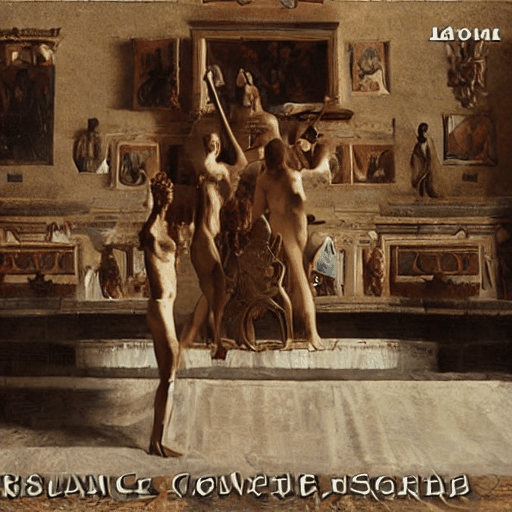

# control-a-video

# KBO DOT MODEL

## git branch 전략

> 메인 브랜치 : main, develop

> 보조 브랜치 : feature
>
> > feaure 브랜치 명명 방식은 feature/[기능이름]

> 릴리즈 브랜치 : release
>
> > dev ->release -> main

> 핫픽스 브랜치 : hotfix
>
> > main -> hotfix -> main

&nbsp;

## Commit, PR시

- Rule 1 : Commit양식은 아래를 따릅니다.
- Rule 2 : 제목은 영어로, 본문은 한글로 작성하여 주세요.

```
# <타입>: <제목>

##### 제목은 최대 50 글자까지만 입력 ############## -> |


# 본문은 위에 작성
######## 본문은 한 줄에 최대 72 글자까지만 입력 ########################### -> |

# 꼬릿말은 아래에 작성: ex) #이슈 번호

# --- COMMIT END ---
# <타입> 리스트
#   feat    : 기능 (새로운 기능)
#   fix     : 버그 (버그 수정)
#   refactor: 리팩토링
#   style   : 스타일 (코드 형식, 세미콜론 추가: 비즈니스 로직에 변경 없음)
#   docs    : 문서 (문서 추가, 수정, 삭제)
#   test    : 테스트 (테스트 코드 추가, 수정, 삭제: 비즈니스 로직에 변경 없음)
#   chore   : 기타 변경사항 (빌드 스크립트 수정 등)
# ------------------
#     제목 첫 글자를 대문자로
#     제목은 명령문으로
#     제목 끝에 마침표(.) 금지
#     제목과 본문을 한 줄 띄워 분리하기
#     본문은 "어떻게" 보다 "무엇을", "왜"를 설명한다.
#     본문에 여러줄의 메시지를 작성할 땐 "-"로 구분
# ------------------
```

```
ex)
docs: Update README

가독성이 더 좋은 commit 메시지로 업데이트 하였습니다.
```

## 주석 Convention

- Rule 3 : 함수, 클래스 단위로 아래 주석 형식을 따라주세요.
  - description은 전체적인 기능, 동작이 복잡하다면 자세하게 써주세요.

```
 /**
  *@author BeomGi-Lee, jeongiun@naver.com
  *@date 2023-08-11
  *@description 상단에 고정적으로 위치하는 Header
  *             로고, Main Navigator, 검색창,
  *             KR/EN 버튼, Side Navigator 포함
  */
```

- Rule 4 : 함수 안에 큰 컴포넌트 단위로 한줄주석 혹은 return문 내에 주석을 달아주세요.

```
// return 문 외
// 한줄 주석

{/* return 문 내 */}
{/* 메뉴, 검색창, 언어버튼 */}
{/* 사이드 메뉴 */}
```

## Code Convention

Rule 5 : 기본적인 Convention은 VS Code 확장 Prettier을 사용합니다.

- 파일 저장 시 서식이 자동 지정되도록 Format On Save 기능을 사용해주세요.

## Code Review

Rule 6 : PR된 Code를 Review하시고 이상 없어보이면 LGTM(Look Good To Me) 댓글을 남겨주세요.  
Rule 7 : 더 좋은 방법이나 수정하면 좋을 것 같은 부분 댓글로 남겨주세요.  
Rule 8 : Code에 관련된 부분만 지적하여 주세요.  
Rule 9 : LGTM 3명 즉 3명이상의 Code Review를 통과하면 Merge합니다.

## Issue Convention

Rule 10 : 이슈 작성시 아래의 형식을 따라주세요.

```
## 📒 이슈 내용
> "이슈 내용 작성"

## 📑 상세 내용
1. "상세 내용 1"
2. "상세 내용 2"

## ✔️ 체크리스트
- [ ] 상세 내용 1.
- [ ] 상세 내용 2.
```

<!--  -->

<!-- Official Implementation of ["Control-A-Video: Controllable Text-to-Video Generation with Diffusion Models"](https://arxiv.org/abs/2305.13840)

- [Project Page](https://controlavideo.github.io)
- [Online Demo](https://huggingface.co/spaces/wf-genius/Control-A-Video)

Similar to Controlnet, We otain the condition maps from another video, and we support three kinds of control maps at this time. -->

## Model

|                               depth control                                |                        depth control                        |                     depth control                      |
| :------------------------------------------------------------------------: | :---------------------------------------------------------: | :----------------------------------------------------: |
| <br> abstract painting | <br> renaissance | <br> gogh-style |

# Setup

The model has been tesed in torch version: `1.13.1+cu117`, simply run

```
pip3 install -r requirements.txt
```

# Usage

## 1. Quick Use

We provide a demo for quick testing in this repo, simply running:

```
python3 inference.py --prompt "a bear walking through stars, artstation" --input_video bear.mp4 --control_mode depth
```

Args:

- `--input_video`: path of input video(mp4 format).
- `--num_sample_frames`: nums of frames to generate. (recommend > 8).
- `--each_sample_frame`: sampling frames for each time. (for auto-regressive generateion.)
- `--sampling_rate`: skip sampling from the input video.

- `--control_mode`: allows for different control, currently support **`canny`, `depth`, `hed`**. (you need to download the weight of **hed** annotator from [link](https://huggingface.co/wf-genius/controlavideo-hed/resolve/main/hed-network.pth) and put it in work space.)
- `--video_scale`: guidance scale of video consistency, borrows from GEN-1. (don't be too large, 1~2 work well, set 0 to disable it.)
- `--init_noise_thres`: the propoed threshold of residual-based noise init. (range from 0 to 1, larger value leads to more smooth but may introduce artifacts.)

- `--inference_step, --guidance_scale, --height, --width, --prompt`: same as other T2I model.

If the automatic downloading not work, the models weights can be downloaded from: [depth_control_model](https://huggingface.co/wf-genius/controlavideo-depth), [canny_control_model](https://huggingface.co/wf-genius/controlavideo-canny), [hed_control_model](https://huggingface.co/wf-genius/controlavideo-hed).

## 2. Auto-Regressive Generation

Our model firstly generates the first frame. Once We get the first frame, we generate the subsquent frames conditioned on the first frame. Thus, it will allow our model to generate longer videos auto-regressive. (This operation is still under experiment and it may collaspe after 3 or 4 iterations.)

```
python3 inference.py --prompt "a bear walking through stars, artstation" --input_video bear.mp4 --control_mode depth --num_sample_frames 16 --each_sample_frame 8
```

Note that `num_sample_frames` should be multiple of `each_sample_frame`.

## Replace the 2d model (Experimentally)

Since we freeze the 2d model, you can replace it with any other model based on `stable-diffusion-v1-5` to generate custom-style videos.

```
state_dict_path = os.path.join(pipeline_model_path, "unet", "diffusion_pytorch_model.bin")
state_dict = torch.load(state_dict_path, map_location="cpu")
video_controlnet_pipe.unet.load_2d_state_dict(state_dict=state_dict)    # reload 2d model.
```

# Acknowledgement

This repository borrows heavily from [Diffusers](https://github.com/huggingface/diffusers), [ControlNet](https://github.com/lllyasviel/ControlNet), [Tune-A-Video](https://github.com/showlab/Tune-A-Video), thanks for open-sourcing! This work was done in Bytedance, thanks for the cooperators!
